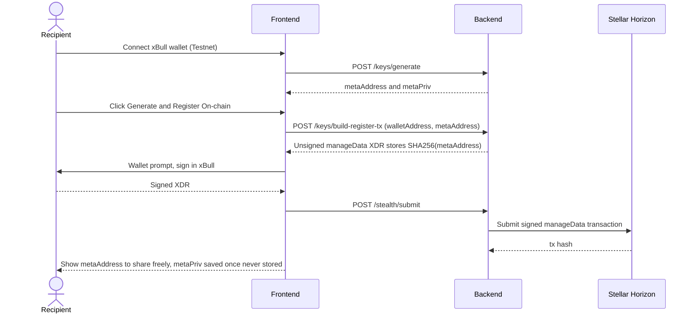
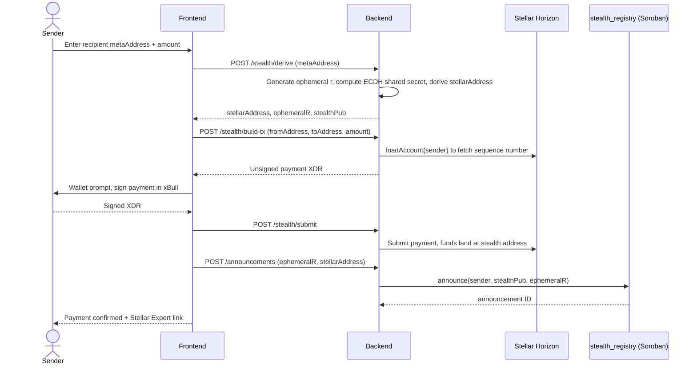
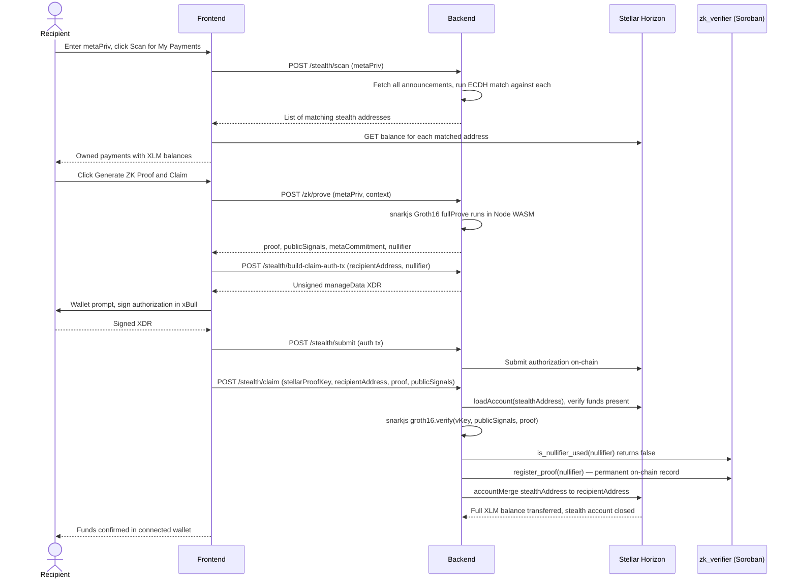

# StealthPay — Private Payments on Stellar

> **DoraHacks Hackathon 2026 Submission**
>
> *The first stealth-address + zero-knowledge proof payment system on Stellar — turning financial privacy from a theoretical concept into a live, usable primitive on a real-world payments blockchain.*

---

## Deployed Contracts

### 🔵 Stellar Testnet

| Contract | Address |
|---|---|
| `stealth_registry` | [`CCZIV6AMJENSG4KL5672UETO6QSSBH7DFCUYZBFKOT6AJKBH5KJONTT2`](https://stellar.expert/explorer/testnet/contract/CCZIV6AMJENSG4KL5672UETO6QSSBH7DFCUYZBFKOT6AJKBH5KJONTT2) |
| `zk_verifier` | [`CC7DILNIL3JHPW4Y75TQBYPLFV7WWXV2DFP5GXFA7ZZRWKT3DBJNVCZR`](https://stellar.expert/explorer/testnet/contract/CC7DILNIL3JHPW4Y75TQBYPLFV7WWXV2DFP5GXFA7ZZRWKT3DBJNVCZR) |

> Explorer: [stellar.expert/explorer/testnet](https://stellar.expert/explorer/testnet)

---

## 1. What is ZK Stellar?

ZK Stellar is a **privacy layer for Stellar payments**. On any public blockchain, your wallet address is a permanent surveillance record — every payment you ever sent or received is visible to anyone with an internet connection. ZK Stellar breaks this with two cryptographic primitives working together: **stealth addresses** and **Groth16 zero-knowledge proofs**.

```
REGISTER  →  Generate a keypair (metaAddress + metaPriv).
             Sign a manageData tx to anchor your identity on-chain.

SEND      →  Sender computes a fresh one-time stealth address from your
             public metaAddress using ECDH. Funds land there.
             Nothing on-chain links the payment to your real wallet.

SCAN      →  Recipient runs metaPriv over all public announcements locally.
             Matching stealth addresses are theirs. No server sees the key.

PROVE     →  Generate a Groth16 ZK proof in-browser via snarkjs (WASM).
             Prove you own the stealth address without revealing any key.

CLAIM     →  Funds merge from stealth account → real wallet via accountMerge.
             Stealth account permanently closed. Done.
```

No mixers. No bridges. No custodians. Pure cryptography on Stellar.

---

## 2. The Problem — Why Now?

### 2.1 Every Stellar Wallet Is a Permanent Surveillance Record

On Stellar — and on every other public blockchain without explicit privacy tooling — your wallet address is fully transparent by design:

| Problem | Reality |
|---|---|
| **Every payment is public** | Sender, recipient, amount, and timestamp are permanently visible on-chain |
| **Analytics tools exist today** | Services like StellarExpert reconstruct complete payment histories in seconds from a single address |
| **No native opt-out** | Stellar has no built-in privacy primitive — you cannot hide transactions without a dedicated layer |
| **Physical-world risk** | For humanitarian aid recipients, remittance workers, whistleblowers, and activists, a visible wallet address is a physical safety threat |
| **Business confidentiality** | Competitors can monitor treasury movements, salary payments, and supplier relationships in real time |

### 2.2 Existing Privacy Solutions Fail on Stellar

The privacy tooling that exists today either doesn't reach Stellar at all, or creates new problems:

| Approach | Problem |
|---|---|
| **Monero / Zcash** | Separate chain — forces users to bridge, adds complexity, breaks Stellar's payment rails |
| **Tornado Cash-style mixers** | Banned by regulators in most jurisdictions; OFAC sanctioned; centralized point of failure |
| **CEX intermediation** | Requires KYC, full custody, and trust in a third party — defeats the purpose |
| **Manual address rotation** | Requires coordination, doesn't hide the graph, breaks payment UX |
| **Nothing** | The current state of Stellar — a payments network with zero privacy primitives |

### 2.3 ZK Proofs Have Finally Become Practical for Browsers

Until recently, generating a Groth16 proof required server-side compute or a native application. In 2024–2025, snarkjs matured to the point where WASM-based proving in the browser is fast enough for real users (10–30 seconds). ZK Stellar is built on this moment — privacy that requires no trusted compute server.

---

## 3. The Solution

ZK Stellar reframes privacy on Stellar from "use a different chain" to "use a cryptographic envelope on the same chain."

### Core Loop

```
REGISTER (one-time keypair setup)
  → SEND (sender derives stealth address from your public key)
    → SCAN (recipient finds their payments locally)
      → PROVE (generate ZK proof of ownership in browser)
        → CLAIM (accountMerge transfers all XLM to real wallet)
```

### Key Design Choices

| Decision | Why |
|---|---|
| **Single keypair** | No scan/spend key split — simpler UX, same cryptographic security for this scheme |
| **ECDH stealth addresses** | Each payment lands at a mathematically fresh address — chain-level unlinkability |
| **In-browser ZK proving** | `metaPriv` never leaves the device — snarkjs runs entirely in WASM |
| **Poseidon nullifiers** | ZK-friendly hash prevents replay attacks without revealing the key |
| **Soroban for nullifiers** | Nullifier registry lives on-chain — no central server to trust or censor |
| **accountMerge for claims** | Moves full XLM balance and permanently closes the stealth account in one operation |
| **Off-chain announcements** | Sender hints stored on-chain via the registry contract — anyone can scan, no metadata leaked |

### Why This Directly Answers

A wallet address is only useful to an attacker if it is *static* and *linkable* to a person. StealthPay removes both properties:

- **No static address** — every incoming payment lands on a brand-new stealth address. There is no single "your wallet" to surveil, threaten, or extort.
- **No linkability** — the on-chain payment carries no metadata back to the recipient's real wallet. Even the sender cannot trace the recipient after the fact.
- **No forced disclosure** — claiming funds requires a ZK proof, not a public reveal. A recipient never has to expose their real wallet to receive or scan for money.

---

## 4. Why Zero-Knowledge Is the Core of Everything Here

The entire system has two hard requirements that seem to contradict each other:

**Requirement 1** — The recipient must be able to prove they own the stealth address to claim the funds.

**Requirement 2** — That proof cannot reveal their private key, or the entire privacy guarantee collapses.

This is exactly the problem ZK proofs were built to solve.

### How the Two Keys Connect

When a sender pays you, they use your public `metaAddress` to mathematically derive a fresh stealth address. That stealth address is cryptographically derived FROM your `metaAddress` — but no one on-chain can see that link. It looks like a random address to every observer. Now you need to prove that stealth address is yours.

### The Problem Without ZK

Without ZK, your only option is to sign a transaction with your `metaPriv`. But the moment you sign anything with `metaPriv` on-chain, the link is visible — this private key controls both the stealth address AND your meta identity. You have just connected them publicly. Privacy destroyed.

### What ZK Solves

Instead of revealing `metaPriv`, you run it through the Circom circuit:

```
Private input:  metaPriv  (never leaves your device)
                    ↓
Poseidon(metaPriv, metaPriv)  =  metaCommitment  ← published on-chain
Poseidon(metaPriv, context)   =  nullifier        ← published on-chain
```

The proof says: *"I know the private key behind this metaAddress, and I am the one who derived this stealth address — without showing you the key."*

The chain verifies the math. The nullifier is locked. The funds release. Your private key was never seen by anyone.

### The Two-Layer Guarantee

| Layer | What it does | What ZK protects |
| --- | --- | --- |
| **ECDH stealth address** | Hides WHO received the payment | Sender cannot reverse-engineer your identity from the on-chain data |
| **Groth16 ZK proof** | Proves YOU own the stealth address | You claim funds without linking your real wallet to the stealth address on-chain |

Remove either layer and the system breaks. ECDH alone lets you receive privately but you cannot claim without revealing yourself. ZK alone without stealth addresses means the payment still lands at your known wallet. Both together is what makes the full privacy guarantee work.

---

## 5. Competitive Landscape

A feature-by-feature comparison against the closest alternatives.

| Feature | Monero | Zcash | Ethereum + Tornado | **ZK Stellar** |
| --- | --- | --- | --- | --- |
| **Runs on Stellar** | ✕ Separate chain | ✕ Separate chain | ✕ Ethereum only | ✅ Native Stellar |
| **Stealth addresses** | ✅ Built-in | ~ Partial | ✕ Not native | ✅ ECDH on secp256k1 |
| **ZK ownership proofs** | ✕ None | ~ Sapling | ✕ None | ✅ Groth16 in-browser |
| **In-browser proving** | ✕ No | ✕ No | ✕ No | ✅ snarkjs WASM |
| **No custodian** | ✅ | ✅ | ✅ | ✅ |
| **Regulatory risk** | ✕ OFAC targeted; exchange delistings | ~ Grey area | ✕ Tornado Cash sanctioned | ✅ Selective disclosure + ZK compliance |
| **Selective disclosure** | ✕ All-or-nothing | ~ View keys | ✕ None | ✅ ZK proof reveals only what you choose |
| **Nullifier replay protection** | ✅ | ✅ | ✅ | ✅ On-chain Soroban |
| **Payments UX** | ✕ Slow, complex | ✕ Complex | ✕ High gas | ✅ Stellar speed + low fees |

### Key Differentiators

**🔐 Selective Disclosure** — Unlike Monero or mixer-based systems, ZK Stellar lets recipients generate a Groth16 proof that proves ownership of a specific payment to a specific party — a compliance officer, an auditor, or a grant committee — without revealing their full payment history.

**🧠 In-Browser Proving** — The private key never leaves the user's device. snarkjs runs entirely in WebAssembly inside the browser tab. No trusted compute server, no custodian.

**⚡ Built on Stellar** — Stellar's existing payment rails, low fees, and fast finality are preserved. ZK Stellar is a privacy envelope around the existing network, not a replacement.

**🛡️ Replay Protection On-Chain** — Nullifiers are stored on the Soroban `zk_verifier` contract. Each proof can be submitted exactly once, enforced by the chain itself.

---

## 6. Cryptographic Design

### Key System — Single Keypair

ZK Stellar uses **one secp256k1 keypair** per user. No separate scan/spend key split.

| Key | Type | Purpose |
|---|---|---|
| `metaAddress` | secp256k1 compressed public key (33 bytes, hex) | Share publicly. Senders derive stealth addresses from this. |
| `metaPriv` | secp256k1 private key (32 bytes, hex) | Keep secret. Used for scanning and claiming. Never stored on any server. |

### Stealth Address Derivation — Sender

```
r         = random scalar (ephemeral private key — discarded after use)
R         = r · G                         (ephemeral public key → published as announcement)
S         = r · metaAddress               (ECDH shared secret — only recipient can compute)
h         = SHA256(Sx ‖ Sy)
P_stealth = metaAddress + h · G           (one-time stealth public key)
```

The sender publishes `(P_stealth, R)`. No information about the recipient's real wallet leaks — the sender cannot trace the recipient either.

### Payment Recognition — Recipient

```
S′        = metaPriv · R                  (same secret: metaPriv·r·G = r·metaPriv·G)
h′        = SHA256(S′x ‖ S′y)
P′        = metaAddress + h′ · G
```

If `P′ == P_stealth` in an announcement → this payment belongs to the recipient.

### Spend Key Derivation — Claim

```
stealthPriv = metaPriv + h  (mod secp256k1 curve order)
stellarSeed = SHA256(stealthPriv)          → Ed25519 keypair for the Stellar account
```

This keypair controls the stealth Stellar account and signs the `accountMerge` transaction.

---

## 7. ZK Circuit

**File:** `circuits/src/stealth_ownership.circom`

```circom
pragma circom 2.1.6;
include "circomlib/circuits/poseidon.circom";

template StealthOwnership() {
    // Private inputs — never leave the prover's device
    signal input scanPriv;        // metaPriv (scan key)
    signal input spendPriv;       // metaPriv (same key — single-keypair scheme)

    // Public inputs — go on-chain with the proof
    signal output metaCommitment; // Poseidon(scanPriv, spendPriv) — identity anchor
    signal output nullifier;      // Poseidon(scanPriv, context) — anti-replay token
    signal output context;        // supplied by verifier (e.g. 0x01)

    // Constraint 1: prover knows the private key behind this meta-address
    component metaHash = Poseidon(2);
    metaHash.inputs[0] <== scanPriv;
    metaHash.inputs[1] <== spendPriv;
    metaHash.out === metaCommitment;

    // Constraint 2: nullifier is honestly derived from the same key + context
    component nullHash = Poseidon(2);
    nullHash.inputs[0] <== scanPriv;
    nullHash.inputs[1] <== context;
    nullHash.out === nullifier;
}

component main {public [metaCommitment, nullifier, context]} = StealthOwnership();
```

### What the Proof Reveals

| Signal | Value | What It Proves |
|---|---|---|
| `metaCommitment` | `Poseidon(metaPriv, metaPriv)` | Prover controls the meta-address — without revealing the key |
| `nullifier` | `Poseidon(metaPriv, context)` | This proof can only be submitted once — prevents replay attacks |
| `context` | Verifier-supplied constant | Binds the proof to a specific claim instance |

Private inputs (`metaPriv`) are never transmitted to any server — snarkjs runs entirely in the browser via WebAssembly.

### Proof System

| Property | Value |
|---|---|
| Circuit language | Circom 2.1.6 |
| Proof system | Groth16 (BN254) |
| Hash function | Poseidon (ZK-friendly, efficient in circuits) |
| Proving library | snarkjs 0.7.6 |
| Proving environment | In-browser WASM — no server involved |
| Trusted setup | Powers of Tau (ptau phase 1 + phase 2) |

---

## 8. Soroban Smart Contracts

Two Rust contracts deployed on Stellar Soroban Testnet.

### `stealth_registry` — Announcement Registry

Stores stealth payment announcements on-chain. Every `announce` call requires sender authentication (`sender.require_auth()`).

```rust
pub struct Announcement {
    pub id: u32,
    pub stealth_address: Bytes,    // compressed secp256k1 public key of stealth address
    pub ephemeral_r: Bytes,        // sender's ephemeral R point — recipient's scanning hint
    pub sender: Address,
    pub timestamp: u64,
}

pub fn announce(env: Env, sender: Address, stealth_address: Bytes, ephemeral_r: Bytes) -> u32
pub fn get_announcements(env: Env, from: u32, count: u32) -> Vec<Announcement>
pub fn get_count(env: Env) -> u32
```

Emits a Soroban event `("announce", (id, stealth_address, ephemeral_r))` on each post — compatible with Horizon event streaming.

### `zk_verifier` — Nullifier Registry

Registers ZK proof nullifiers on-chain to prevent replay attacks. Proof verification runs off-chain (snarkjs); only the nullifier commitment is stored on-chain.

```rust
pub struct ProofRecord {
    pub meta_commitment: BytesN<32>,
    pub nullifier:       BytesN<32>,
    pub context:         BytesN<32>,
    pub proof_hash:      BytesN<32>,   // SHA256 of raw proof bytes — audit trail
    pub submitter:       Address,
    pub timestamp:       u64,
}

// Register a verified nullifier on-chain (idempotent — safe to retry)
pub fn register_proof(env: Env, submitter: Address,
                      meta_commitment: BytesN<32>, nullifier: BytesN<32>,
                      context: BytesN<32>, proof_hash: BytesN<32>) -> bool

// Anti-replay check — returns true if this nullifier has already been used
pub fn is_nullifier_used(env: Env, nullifier: BytesN<32>) -> bool

// Retrieve the full proof record for a given nullifier
pub fn get_proof_record(env: Env, nullifier: BytesN<32>) -> Option<ProofRecord>
```

**Replay-protection guarantee:** once a nullifier is stored, any further call with the same nullifier panics immediately. Each ZK proof can be claimed exactly once, enforced by the chain.

> **Note on full on-chain verification:** The contract includes a `verify_and_register` entry point that runs full Groth16 pairing arithmetic (ark-bn254 + ark-groth16 compiled to WASM). BN254 pairing computation exceeds Soroban's current WASM CPU budget (~100M instructions). The production path verifies off-chain via snarkjs and commits the nullifier on-chain. Full on-chain verification will be enabled when Soroban adds native BLS12-381 host functions (Protocol 22+).

---

## 9. Architecture

```
┌──────────────────────── User / Browser ────────────────────────────────┐
│  Next.js 15 frontend (React 19, TypeScript, Tailwind CSS v4)           │
│                                                                        │
│  @creit.tech/stellar-wallets-kit  — xBull + Freighter wallet connect   │
│  snarkjs (WASM)                   — Groth16 proof generation in-browser│
│  @react-three/fiber + three-globe — 3D globe background                │
│  Shadcn UI + Radix                — Component library                  │
│                                                                        │
│  Pages: / · /send · /receive · /prove · /history                       │
└───────────────────────────────────┬────────────────────────────────────┘
                                    │ HTTP (localhost:4000)
                                    ▼
┌──────────────────────── Backend (Express :4000) ────────────────────────┐
│  POST /stealth/derive             — ECDH stealth address derivation     │
│  POST /stealth/scan               — Scan announcements for owned pays   │
│  POST /stealth/build-tx           — Build unsigned Stellar payment XDR  │
│  POST /stealth/submit             — Submit signed XDR to Horizon        │
│  POST /stealth/claim              — snarkjs verify → nullifier → merge  │
│  POST /stealth/build-claim-auth-tx — Build claim-authorization tx XDR   │
│  POST /keys/generate              — Fresh secp256k1 keypair             │
│  POST /keys/build-register-tx     — manageData tx for registration      │
│  POST /zk/prove                   — Groth16 proof via snarkjs           │
│  POST /zk/verify                  — Off-chain proof verification        │
│  GET  /announcements              — Paginated announcement list         │
│  POST /announcements              — Post new stealth payment hint       │
│                                                                         │
│  Crypto: @noble/curves (secp256k1) · @noble/hashes · poseidon-lite      │
└───────────────────────────────────┬─────────────────────────────────────┘
                                    │
                     Stellar Horizon Testnet (horizon-testnet.stellar.org)
                     Soroban RPC (soroban-testnet.stellar.org)
                                    │
                                    ▼
┌──────────────────────── Stellar Testnet ──────────────────────────────┐
│  stealth_registry.rs  — On-chain announcement store (Soroban)         │
│  zk_verifier.rs       — Nullifier registry + proof records (Soroban)  │
│  Stellar Horizon      — Payment submission, account queries           │
│  manageData ops       — Wallet ↔ meta-address identity binding        │
│  accountMerge ops     — Full XLM transfer + stealth account close     │
└───────────────────────────────────────────────────────────────────────┘
```

---

## 10. Full Sequence Flow

### Registration



### Send Payment



### Scan & Claim



---

## 11. Repository Structure

```
stellar/
├── README.md
│
├── backend/
│   ├── index.js                      # Express API — all routes + stealth crypto
│   ├── package.json
│   └── data/                         # gitignored — created at runtime
│       ├── announcement_meta.json    # off-chain sidecar: stellarAddress + txHash
│       └── meta_map.json             # wallet → meta-address mapping
│
├── circuits/
│   ├── src/
│   │   └── stealth_ownership.circom  # Groth16 circuit: metaCommitment + nullifier
│   ├── build/
│   │   ├── stealth_ownership.r1cs    # compiled R1CS constraints
│   │   ├── stealth_ownership.wasm    # WASM witness generator
│   │   ├── stealth_ownership.zkey    # Groth16 proving key
│   │   ├── verification_key.json     # verifier key
│   │   └── stealth_ownership_js/     # witness calculator JS
│   ├── scripts/
│   │   └── generate_proof.js         # snarkjs fullProve + verify wrapper
│   └── package.json
│
├── contracts/
│   ├── Cargo.toml                    # workspace
│   ├── stealth_registry/
│   │   └── src/lib.rs                # Soroban: on-chain announcement store
│   └── zk_verifier/
│       └── src/lib.rs                # Soroban: nullifier registry + proof records
│   
│                    
│
└── frontend/
    ├── app/
    │   ├── page.tsx                  # Landing page (3D globe + sections)
    │   ├── send/page.tsx             # Send a private payment
    │   ├── receive/page.tsx          # Register keys + scan for payments
    │   ├── prove/page.tsx            # Generate ZK proof + claim funds
    │   └── history/page.tsx          # Public announcement history
    ├── components/
    │   ├── navbar.tsx
    │   ├── hero-section.tsx
    │   ├── about-section.tsx         # Privacy problem + solution
    │   ├── three-tier-section.tsx    # How-it-works steps
    │   ├── skills-section.tsx        # Tech stack bento grid
    │   ├── cta-section.tsx           # Action cards
    │   ├── footer.tsx
    │   ├── zk-scene.tsx              # Three.js globe (R3F)
    │   └── ui/                       # Shadcn components
    ├── hooks/
    │   ├── wallet-context.tsx        # xBull/Freighter wallet state
    │   └── use-wallet.ts
    └── package.json
```

---

## 12. Local Development

### Prerequisites

- **Node.js** 20+
- **Rust + Cargo** — `curl --proto '=https' --tlsv1.2 -sSf https://sh.rustup.rs | sh`
- **Stellar CLI** — `cargo install --locked stellar-cli`
- **xBull wallet** browser extension — set to **Testnet** mode

### 1. Clone and install

```bash
git clone https://github.com/theyuvan/stellar.git
cd stellar

cd backend  && npm install && cd ..
cd circuits && npm install && cd ..
cd frontend && npm install && cd ..
```

### 2. Start the backend

```bash
cd backend
node index.js
# → ZK Stellar backend listening on 4000
```

### 3. Start the frontend

```bash
cd frontend
npm run dev
# → http://localhost:3000
```

### 4. (Optional) Rebuild the ZK circuit

> Build artifacts are committed — skip this unless you modify the circuit.

```bash
cd circuits

# Compile
circom src/stealth_ownership.circom --r1cs --wasm --sym -o build/

# Trusted setup
snarkjs powersoftau new bn128 12 pot12_0000.ptau
snarkjs powersoftau contribute pot12_0000.ptau pot12_0001.ptau --name="ZK Stellar"
snarkjs powersoftau prepare phase2 pot12_0001.ptau pot12_final.ptau

# Generate proving key
snarkjs groth16 setup build/stealth_ownership.r1cs pot12_final.ptau build/stealth_ownership_0000.zkey
snarkjs zkey contribute build/stealth_ownership_0000.zkey build/stealth_ownership.zkey --name="ZK Stellar"
snarkjs zkey export verificationkey build/stealth_ownership.zkey build/verification_key.json
```

### 5. (Optional) Deploy contracts

```bash
# Build
cd contracts
cargo build --target wasm32v1-none --release
stellar contract optimize --wasm target/wasm32v1-none/release/stealth_registry.wasm
stellar contract optimize --wasm target/wasm32v1-none/release/zk_verifier.wasm

# Deploy
stellar contract deploy \
  --wasm target/wasm32v1-none/release/stealth_registry.optimized.wasm \
  --source-account YOUR_SECRET_KEY \
  --network testnet

stellar contract deploy \
  --wasm target/wasm32v1-none/release/zk_verifier.optimized.wasm \
  --source-account YOUR_SECRET_KEY \
  --network testnet

# Update REGISTRY_ID and VERIFIER_ID in backend/index.js
```

### 6. End-to-End Test Flow

**Register and send:**

1. Open `localhost:3000` → connect xBull (set to Testnet)
2. Go to `/receive` → click **Generate & Register On-chain** → sign the wallet transaction
3. Copy your `metaAddress`. Save `metaPriv` — it is shown once and never stored.
4. Go to `/send` → paste the `metaAddress` → enter an amount → **Derive Stealth Address** → **Send XLM** → sign in xBull

**Scan and claim:**

1. Go to `/receive` → enter `metaPriv` → **Scan for My Payments**
2. Your payment appears with XLM balance
3. Click **Generate ZK Proof & Claim** → wait ~10–30 seconds for proof generation
4. Sign the claim-authorization transaction in xBull
5. Funds arrive in your connected wallet — stealth account closed

---

## 13. Security Model

| Property | How It Holds |
|---|---|
| **Private key never stored** | `metaPriv` is shown once, then React state is cleared. Never written to localStorage, sessionStorage, or any persistent store. |
| **Scanning is local** | The backend receives `metaPriv` transiently to run ECDH matching — it is never logged, cached, or persisted. |
| **In-browser proving** | snarkjs runs entirely in WASM inside the browser tab. The circuit's private inputs never leave the device. |
| **One-time stealth addresses** | Each payment uses a fresh ephemeral scalar `r`. No two payments to the same recipient share an address. Chain-level unlinkability is preserved. |
| **Replay protection** | Poseidon nullifiers prevent the same proof from being reused. The nullifier is permanently stored on the `zk_verifier` Soroban contract after first use. |
| **Selective disclosure** | Not anonymous mixing. Recipients can generate ZK proofs to selectively prove they received a specific payment to a compliance officer or auditor — without exposing their full payment history. |
| **Non-custodial** | Funds never pass through the backend. The backend builds and submits transactions but holds no keys. The stealth account's private key is derived locally from `metaPriv` on claim. |

---

## License

MIT

---

*Built for the DoraHacks Hackathon 2026 · Running on Stellar Testnet · Privacy-preserving payments without compromise*